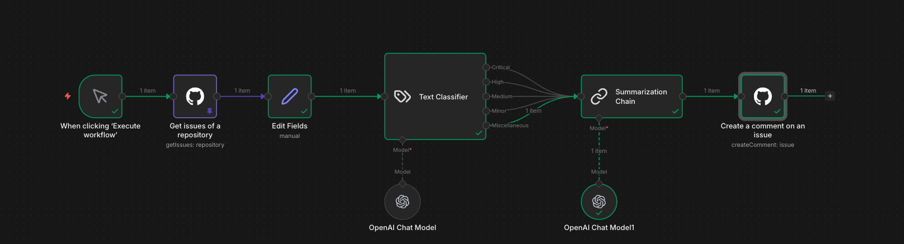
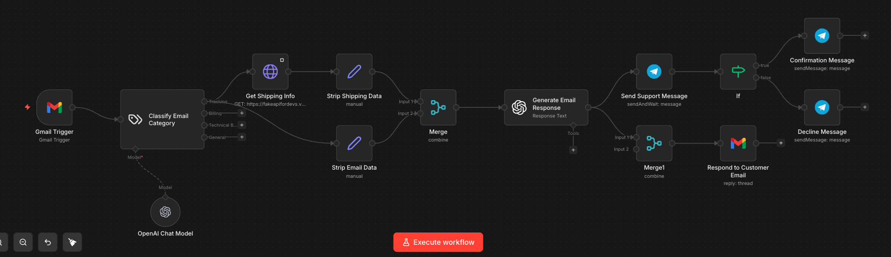

# n8n Automations

A collection of n8n workflows that leverage OpenAI to automate GitHub issue triage and customer support email handling.

## GitHub Issue Triage

Automatically classifies and summarizes GitHub issues, then posts the results back as a comment.

### How it works

1. **Fetch issues** — Retrieves open issues from a configured GitHub repository.
2. **Classify severity** — An OpenAI-powered Text Classifier categorizes each issue into one of five severity levels: *Critical*, *High*, *Medium*, *Minor*, or *Miscellaneous*.
3. **Summarize** — A Summarization Chain (also backed by OpenAI) produces a concise summary of the issue.
4. **Comment** — The classification and summary are posted as a comment on the original GitHub issue.

### Nodes

| Node | Purpose |
|------|---------|
| Get issues of a repository | Pulls issues from GitHub |
| Edit Fields | Prepares issue data for classification |
| Text Classifier | Classifies issue severity via OpenAI |
| Summarization Chain | Generates a concise issue summary via OpenAI |
| Create a comment on an issue | Posts the result back to GitHub |

---

## Customer Support Email Automation

Monitors a Gmail inbox, classifies incoming support emails by category, generates AI-drafted responses, and routes notifications through Telegram.

### How it works

1. **Gmail Trigger** — Watches for new incoming emails.
2. **Classify category** — An OpenAI model categorizes the email (e.g., *Shipping*, *Technical*, *General*).
3. **Enrich context** — For shipping-related emails, the workflow fetches live shipping info from an external API. All branches strip and normalize the relevant data before merging.
4. **Generate response** — An AI node drafts an appropriate email response based on the category and enriched context.
5. **Notify & respond** — A support message is sent to a Telegram channel. The workflow then replies to the customer's email thread and sends either a *Confirmation* or *Decline* message on Telegram depending on the outcome.

### Nodes

| Node | Purpose |
|------|---------|
| Gmail Trigger | Listens for new support emails |
| Classify Email Category | Routes emails by type via OpenAI |
| Get Shipping Info | Fetches shipping data from an external API |
| Strip Shipping Data / Strip Email Data | Normalizes data for downstream processing |
| Merge | Combines enriched data branches |
| Generate Email Response | Drafts a reply using AI |
| Send Support Message | Notifies the team via Telegram |
| Respond to Customer Email | Sends the AI-drafted reply to the customer |
| Confirmation / Decline Message | Posts final status to Telegram |
